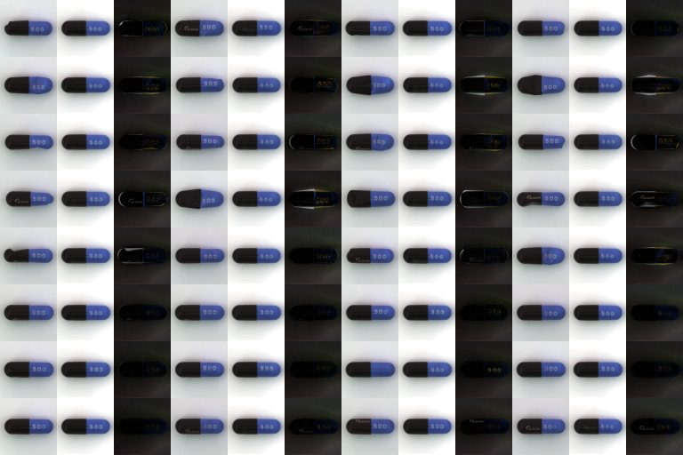
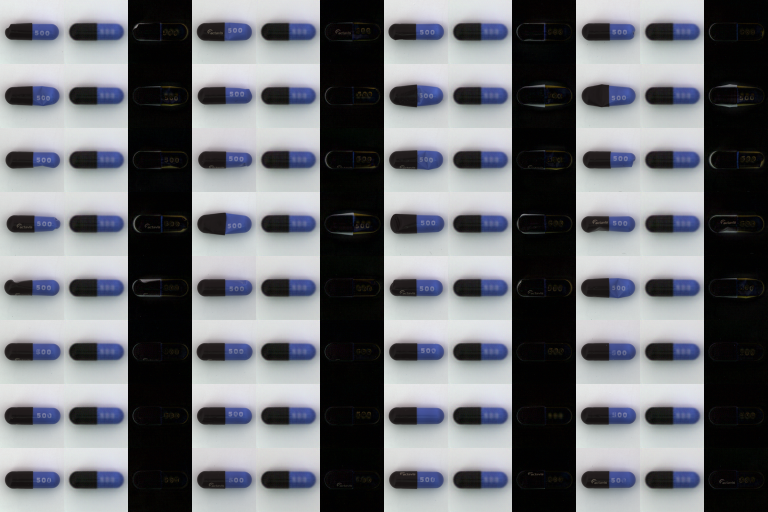
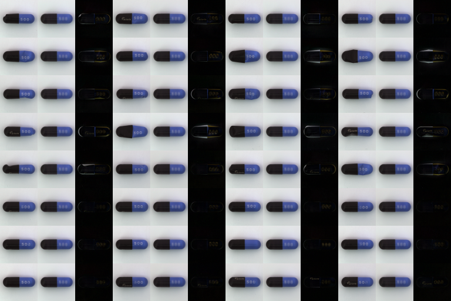
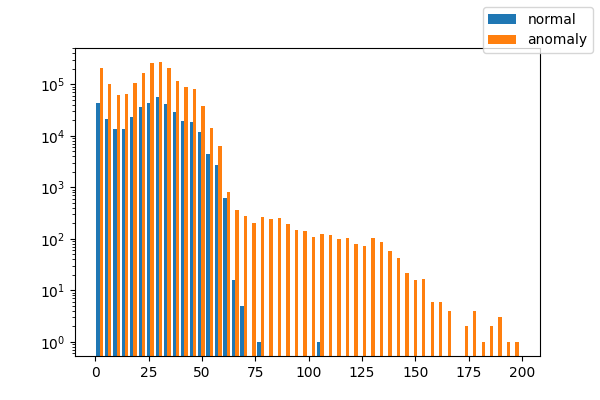
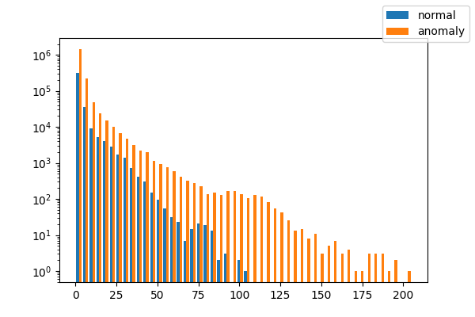
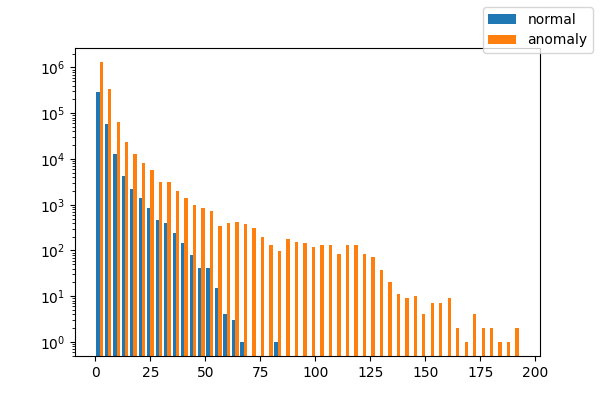

# Anomary detection with AutoEncoder

## Usage
- training
```
python train.py --type ssim ( or mse, msenorm )
```

-inference
```
python train.py --type ssim ( or mse, msenorm ) --weight ./XXXXXX/model_YYY.pth
```

# TensorBoard
https://tensorboard.dev/experiment/Hg9fvXbRQDCj9NSrPO0QAQ/

# Reconstruction Image
Left: GT, Center: Prediction, Right: Difference( GT - Prediction )

- SSIM



- MSE without Normalization



- MSE with Normalization



# Gray scale pixel value Histgrum
- SSIM



- MSE without Normalization



- MSE with Normalization



# Result
Determine that an image with a pixel value of 65 or more for 5 counts or more is anomaly ( label = 1 ).

- SSIM

| Pred / GT | 0 | 1 |
|---|---|---|
|0|23|86|
|1|0|23|

- MSE without Normalization

| Pred / GT | 0 | 1 |
|---|---|---|
|0|22|84|
|1|1|25|

- MSE with Normalization

| Pred / GT | 0 | 1 |
|---|---|---|
| 0 | 23 | 84 |
| 1 | 0  | 25 |
