# Deep SVDD
http://proceedings.mlr.press/v80/ruff18a/ruff18a.pdf

## How to use
- training MNIST All data
```
python train_mnist_all.py
```
- training MNIST except anomaly data<br>
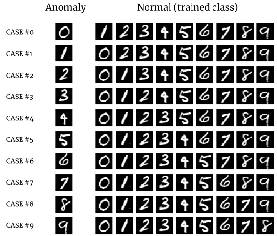 
```
python train_mnist_ano.py
```

# Rsult

## MNIST All data
Scatter plots and radius R plots for training with the latent variable dimension set to 2.<br>
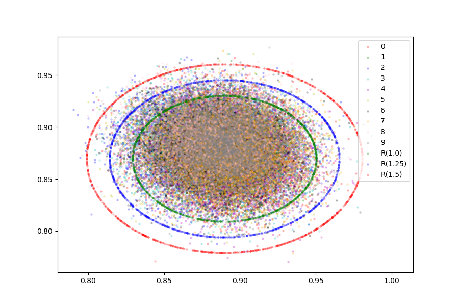

distance > R * 1.25 samples is here.<br>
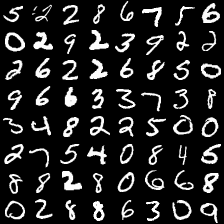

## MNIST except anomaly data
The latent variable dimension set to 16 and Visualization with t-SNE.
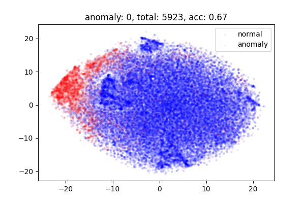
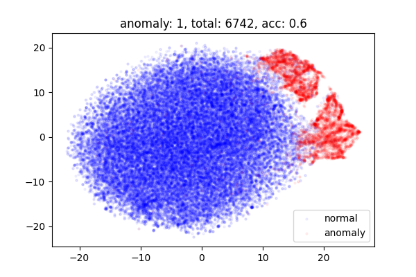
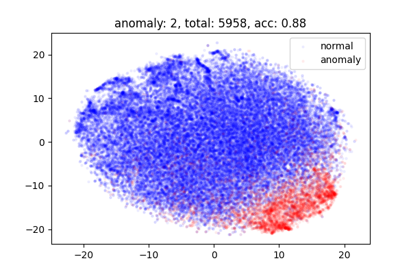
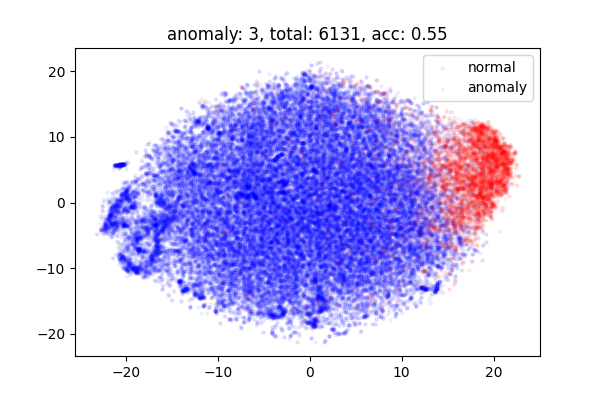
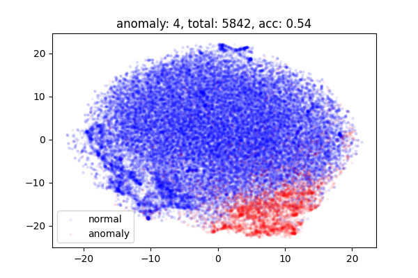
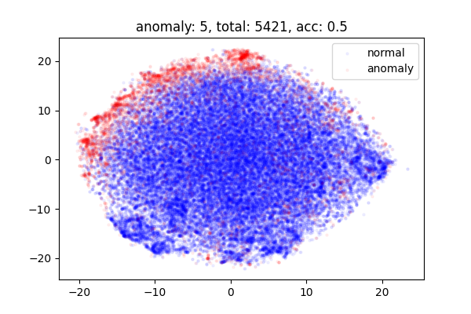
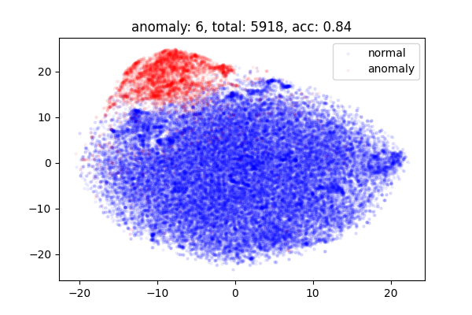
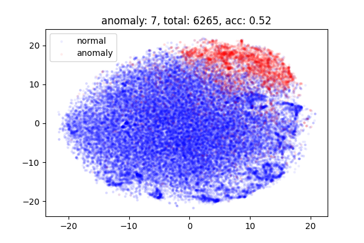
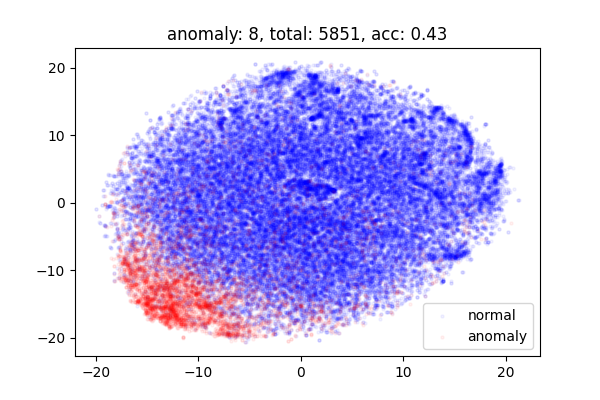
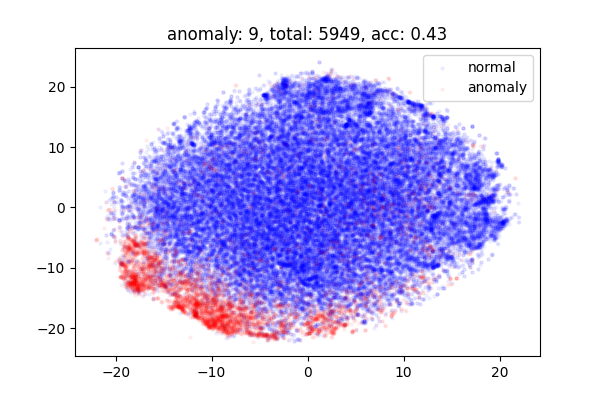
